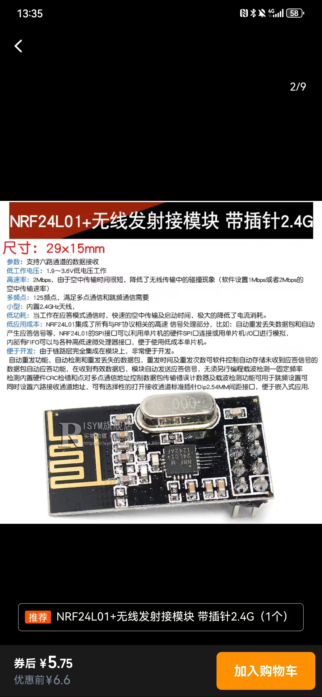

# pi5-nrf24l01-tools

本仓库提供在 **Raspberry Pi 5** 上使用 NRF24L01 模块的示例代码。

## 硬件连接

下表给出了 NRF24L01 与 Raspberry Pi 5 之间的连接方式（BCM 编号）：

| NRF24L01 引脚 | Raspberry Pi 5 |
| ------------- | -------------- |
| VCC           | 3.3V (PIN 1)   |
| GND           | GND (PIN 6)    |
| CE            | GPIO22 (PIN 15) |
| CSN           | SPI0_CE0 (GPIO8, PIN 24) |
| SCK           | SPI0_SCLK (GPIO11, PIN 23) |
| MOSI          | SPI0_MOSI (GPIO10, PIN 19) |
| MISO          | SPI0_MISO (GPIO9, PIN 21) |
| IRQ           | GPIO24 (PIN 18，可选) |

示例设备图片：



所有示例脚本均假设按上表进行接线，如需使用其他引脚，请在代码中修改对应的 GPIO 号。

## 运行示例

安装 Python 依赖：

```bash
sudo apt-get install python3-pip
pip3 install spidev RPi.GPIO lib_nrf24
```

直接运行发送端或接收端脚本：

```bash
# 发送示例
python3 send.py

# 接收示例
python3 receive.py
```


脚本将在终端打印发送或接收到的消息，便于测试 NRF24L01 的通信。
